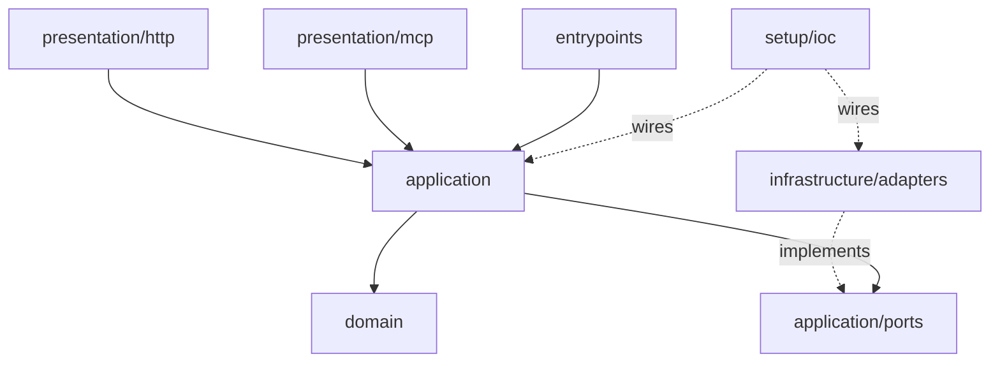

# evenkeel

**A FastAPI backend template that keeps its claims checkable.**

Clean architecture, ports and adapters, and an opt-in slice system — where every
architectural promise is enforced by a machine rather than described in this file.
The layer rules are a CI job. The null adapters are held to the real adapters'
contract by a shared test suite. Readiness is a query, not a constant.

It runs with one command and no credentials. Every optional dependency — Redis,
Prometheus, tracing, a message queue, an identity provider — ships a **null adapter**,
so the core is a working API on its own and scaling up is a swap in one provider
method rather than a rewrite.

```bash
docker compose up
```


Nothing in that recording is staged. It is
[one VHS tape](tools/demo/api.tape) driven against the same image CI boots in
its smoke job, and re-recording it is two commands — which is the point: a
README that can be re-run cannot quietly drift from the code.

---

## Why another template

Most FastAPI templates show you how to wire a framework. This one encodes the
things that only show up after a service has been in production for a while:

| Concern | What the template does |
| --- | --- |
| Readiness | `/ready` actually checks its dependencies and returns 503 when they are down |
| Money | `Decimal` everywhere, arithmetic across currencies raises |
| Concurrency | distributed lock **and** optimistic version — each covers what the other cannot |
| Retries | `Idempotency-Key` is a first-class port, not a per-endpoint hack |
| Timezones | one `TypeDecorator` at the column boundary, so naive datetimes cannot enter |
| Errors | RFC 9457 Problem Details from a single handler, status code declared on the error class |
| Metrics | route templates as labels, never raw paths — the standard way to melt Prometheus |
| Secrets | redaction lives in the log pipeline, not at call sites |
| Outbound calls | timeout, budget, concurrency cap, jittered retry, size cap — with the cost of each one measured under load |
| Architecture | layering is enforced by `import-linter` in CI, not by a README promise |

## Architecture



Dependencies point one way: `presentation → application → domain`. Infrastructure
depends on the ports it implements and nothing depends on infrastructure except the
composition root. The domain imports nothing but the standard library.

A request walks the layers like this:

1. **Router** parses the request and calls one interactor. No business rules.
2. **Interactor** owns policy — rate limit, transaction boundary, metrics — and delegates.
3. **Domain** enforces invariants. A wallet cannot go negative because `Wallet.withdraw` says so, not because an endpoint remembered to check.
4. **Adapters** translate rows to entities and back.

## The example domain

A wallet ledger: open a wallet, deposit, withdraw, list entries. It is deliberately
not a to-do list — money forces the template to demonstrate invariants, concurrency,
idempotency and auditability instead of describing them.

```
POST   /v1/wallets                        open a wallet
GET    /v1/wallets                        list (cursor-paginated)
GET    /v1/wallets/{id}                   read one
POST   /v1/wallets/{id}/deposits          credit    (accepts Idempotency-Key)
POST   /v1/wallets/{id}/withdrawals       debit     (accepts Idempotency-Key)
GET    /v1/wallets/{id}/entries           ledger history
GET    /health  /ready  /version          operations
```

Every failure is an [RFC 9457](https://www.rfc-editor.org/rfc/rfc9457)
`application/problem+json` document, and every status the API can return is
declared in the schema — including the 409s, the 429 and the 503 that most
generated specs omit. Branch on `code`, never on `title`.

## Calling other services

The one outbound dependency — risk assessment before a balance changes — is the
reference for any that follow. It ships with a null adapter (`allow-all`), so
none of it is in the way until you point `APP__RISK__PROVIDER=http` at a URL.

Failures are values, not exceptions: a timeout, a refused connection, a 500, a
malformed body and a full bulkhead all arrive as
`RiskOutcome.UNAVAILABLE`, and the use case decides what that means. Refused and
unavailable are never merged — one is the provider working, the other is the
provider missing.

The guards, and what each one covers:

| | |
| --- | --- |
| bulkhead, refusing rather than queueing | in-flight calls are bounded, and a caller who cannot be served finds out in microseconds |
| per-attempt timeout **and** an overall budget | the worst case is a number someone chose |
| retries with full jitter, honouring `Retry-After` | only where a retry can succeed; never a 400, never a malformed 200 |
| response size cap | a broken upstream cannot spend this process's memory |


`docker compose --profile load up` starts a stub provider with dials for
latency, failure rate and refusal rate, and `tools/load/wallets.js` drives it
under k6. The measurements — including the one that contradicted a docstring in
this repository — are in
[tools/load/README.md](tools/load/README.md), and the reasoning is
[ADR 6](docs/adr/0006-outbound-calls.md).

## API reference

Three renderings of the same document, on a local run only:

| | |
| --- | --- |
| `/scalar` | search, a working request client, dark mode |
| `/docs` | Swagger UI |
| `/redoc` | ReDoc |

`openapi.json` is committed. CI regenerates it and fails if it drifts — the same
treatment migrations get — and runs [oasdiff](https://github.com/oasdiff/oasdiff)
on pull requests so a breaking change to the contract is a red check rather than
a surprise for whoever built against it.

## How the tests are organised

Not a pyramid. Two questions, asked separately:

| Directory | Question it answers | Needs |
| --- | --- | --- |
| `tests/unit` | Do the domain rules and the use-case policy hold? | nothing |
| `tests/contracts` | Does every adapter of a port behave the same? | Redis, optionally |
| `tests/http` | Does the application behave correctly end to end? | nothing |
| `tests/integration` | Does the SQL do what the fake pretends it does? | PostgreSQL |

The split that matters is not unit-versus-integration but *architectural part*
versus *application as a black box*. `unit` and `contracts` test parts; `http`
and `integration` test the thing itself. Testcontainers made the second half
cheap enough that pushing everything into mocks now buys speed by giving up the
only tests that would have caught a broken adapter.

`make test` runs everything that needs no service; `make test-integration` runs
the rest.

## Development

```bash
make sync      # install
make check     # format, lint, architecture contracts, types, tests
make run       # start the API
```

## Status

Milestone 1 (core + example slice) is in place. CI, the observability slice,
tracing, outbox, worker and MCP transport are landing next — see `docs/adr/` for the
decisions behind each.

## License

MIT
