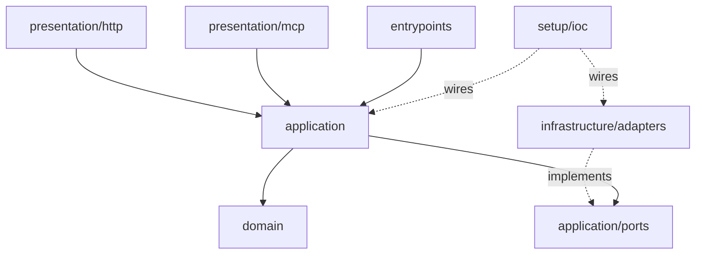

# evenkeel

[](https://github.com/archievega/evenkeel/actions/workflows/ci.yml)
[](.importlinter)
[](pyproject.toml)
[](.github/workflows/ci.yml)
[](pyproject.toml)
[](LICENSE)

**A FastAPI backend template that keeps its claims checkable.**

Each badge links to the file that makes it true, and the first one is the job
that keeps the rest honest — the layer contract, the strict type check and the
coverage floor all run in that pipeline.

Clean architecture, ports and adapters, and an opt-in slice system — where every
architectural promise is enforced by a machine rather than described in this file.
The layer rules are a CI job. The null adapters are held to the real adapters'
contract by a shared test suite. Readiness is a query, not a constant.

It runs with one command and no credentials. Every optional dependency it has —
Redis for the lock, limiter, idempotency store and concurrency cap; Prometheus;
the outbound risk provider; the identity provider — ships a **null adapter**, so
the core is a working API on its own and scaling up is a swap in one provider
method rather than a rewrite.

```bash
docker compose up
```

Or without installing anything: **Code → Codespaces → Create codespace**. The
devcontainer brings up Postgres, installs the environment and applies the
migrations, so the first thing that happens is a working stack rather than a
dependency error.


Nothing in that recording is staged. It is
[one VHS tape](tools/demo/api.tape) driven against the same image CI boots in
its smoke job, and re-recording it is two commands — which is the point: a
README that can be re-run cannot quietly drift from the code.

---

## Why another template

Most FastAPI templates show you how to wire a framework. This one encodes the
things that only show up after a service has been in production for a while:

| Concern | What the template does |
| --- | --- |
| Readiness | `/ready` actually checks its dependencies and returns 503 when they are down |
| Money | `Decimal` everywhere, arithmetic across currencies raises |
| Concurrency | distributed lock **and** optimistic version — each covers what the other cannot |
| Retries | `Idempotency-Key` is a first-class port, not a per-endpoint hack |
| Timezones | one `TypeDecorator` at the column boundary, so naive datetimes cannot enter |
| Errors | RFC 9457 Problem Details from a single handler, status code declared on the error class |
| Metrics | route templates as labels, never raw paths — the standard way to melt Prometheus |
| Secrets | redaction lives in the log pipeline, not at call sites — with the records it does not cover written down rather than glossed over |
| Outbound calls | timeout, budget, concurrency cap, jittered retry, size cap — with the cost of each one measured under load |
| Architecture | layering is enforced by `import-linter` in CI, not by a README promise |

## Architecture



Dependencies point one way: `presentation → application → domain`. Infrastructure
depends on the ports it implements and nothing depends on infrastructure except the
composition root. The domain imports nothing but the standard library.

A request walks the layers like this:

1. **Router** parses the request and calls one interactor. No business rules.
2. **Interactor** owns policy — rate limit, transaction boundary, metrics — and delegates.
3. **Domain** enforces invariants. A wallet cannot go negative because `Wallet.withdraw` says so, not because an endpoint remembered to check.
4. **Adapters** translate rows to entities and back.

## The example domain

A wallet ledger: open a wallet, deposit, withdraw, list entries. It is deliberately
not a to-do list — money forces the template to demonstrate invariants, concurrency,
idempotency and auditability instead of describing them.

```
POST   /v1/wallets                        open a wallet
GET    /v1/wallets                        list (cursor-paginated)
GET    /v1/wallets/{id}                   read one
POST   /v1/wallets/{id}/deposits          credit    (accepts Idempotency-Key)
POST   /v1/wallets/{id}/withdrawals       debit     (accepts Idempotency-Key)
GET    /v1/wallets/{id}/entries           ledger history
GET    /health  /ready  /version          operations
GET    /metrics                           Prometheus, off unless enabled
```

Every failure is an [RFC 9457](https://www.rfc-editor.org/rfc/rfc9457)
`application/problem+json` document, and every status the API can return is
declared in the schema — including the 403, the 409s, the 429 and the 503 that
most generated specs omit. Branch on `code`, never on `title`.

## Calling other services

The one outbound dependency — risk assessment before a balance changes — is the
reference for any that follow. It ships with a null adapter (`allow-all`), so
none of it is in the way until you point `APP__RISK__PROVIDER=http` at a URL.

Failures are values, not exceptions: a timeout, a refused connection, a 500, a
malformed body and a full bulkhead all arrive as
`RiskOutcome.UNAVAILABLE`, and the use case decides what that means. Refused and
unavailable are never merged — one is the provider working, the other is the
provider missing.

The guards, and what each one covers:

| | |
| --- | --- |
| bulkhead, refusing rather than queueing | in-flight calls are bounded, and a caller who cannot be served is refused in under a millisecond instead of paying the provider's latency first |
| per-attempt timeout **and** an overall budget | the worst case is a number someone chose |
| retries with full jitter, honouring `Retry-After` | only where a retry can succeed; never a 400, never a malformed 200 |
| response size cap | a broken upstream cannot spend this process's memory |


`docker compose --profile load up` starts a stub provider with dials for
latency, failure rate and refusal rate, and `tools/load/wallets.js` drives it
under k6. The measurements — including the one that contradicted a docstring in
this repository — are in
[tools/load/README.md](tools/load/README.md), and the reasoning is
[ADR 6](docs/adr/0006-outbound-calls.md).

## A second transport, over the same use cases

`presentation/mcp` exposes the wallet as [MCP](https://modelcontextprotocol.io)
tools, so a model can hold an account. Six tools, each resolving the *same*
interactor the HTTP router resolves:

```bash
APP__MCP__OWNER_ID=<uuid> make run-mcp
```

Nothing below `presentation` changed to add it — no new port, no argument on a
command, no branch in a use case. The idempotency key, the per-wallet lock, the
optimistic version, the rate limit and the outbound risk check all apply to a
tool call because none of them ever lived in the HTTP layer. That is the only
honest way to show the layering is real rather than decorative, and it is why
this exists.

**The owner is configuration, never a tool argument.** A
`deposit(owner_id, ...)` tool would be a cross-tenant IDOR with a
natural-language interface: the model reads untrusted text for a living, so
"it was persuaded to pass a different id" is a normal Tuesday. The parameter
that does not exist cannot be manipulated, and a test asserts on the published
schemas that none of them has one.

Adding this surfaced three defects that one transport had been hiding — an
amount larger than the ledger column can store, `Money(NaN)` raising the wrong
error, and test fakes that disagreed with the database about row order. All
three are fixed in the domain and the fakes, not in the tool layer.
[ADR 7](docs/adr/0007-mcp-as-a-second-transport.md) has the reasoning.

## API reference

Three renderings of the same document, on a local run only:

| | |
| --- | --- |
| `/scalar` | search, a working request client, dark mode |
| `/docs` | Swagger UI |
| `/redoc` | ReDoc |

`make docs` builds the same reference as a static page — the deploy refuses to
publish a document that disagrees with the application, so a page that ships is
also proof the spec is current. The CDN script is version-pinned with an
integrity hash, checked against the file actually served by
`tests/unit/test_docs_page.py`.

`openapi.json` is committed. CI regenerates it and fails if it drifts — the same
treatment migrations get — and runs [oasdiff](https://github.com/oasdiff/oasdiff)
on pull requests so a breaking change to the contract is a red check rather than
a surprise for whoever built against it.

## How the tests are organised

Not a pyramid. Two questions, asked separately:

| Directory | Question it answers | Needs |
| --- | --- | --- |
| `tests/unit` | Do the domain rules and the use-case policy hold? | nothing |
| `tests/contracts` | Does every adapter of a port behave the same? | Redis, optionally |
| `tests/http` | Does the application behave correctly end to end? | nothing |
| `tests/integration` | Does the SQL do what the fake pretends it does? | PostgreSQL |

The split that matters is not unit-versus-integration but *architectural part*
versus *application as a black box*. `unit` and `contracts` test parts; `http`
and `integration` test the thing itself. Testcontainers made the second half
cheap enough that pushing everything into mocks now buys speed by giving up the
only tests that would have caught a broken adapter.

`make test` runs everything that needs no service; `make test-integration` runs
the rest.

## For agents

[`AGENTS.md`](AGENTS.md) is the rule set an agent gets before it edits anything:
the layer table, a "task → files, in order" map, DO/DON'T for the rules with
teeth, an anti-pattern table of every trap this build actually hit, and the list
of changes that must stop and ask a human. `CLAUDE.md` points at it, so both
conventions resolve to one file.

Most of those rules are a command rather than a paragraph — `make arch` fails on
a crossed layer, `make types` on an adapter that drifted from its port,
`make schema-check` on an HTTP contract that changed without the document
changing with it. Two conventions became checks while this was written: every
adapter must be named in `conformance.py`
(`tests/unit/test_adapter_conformance.py`), and the scaffolder's own output must
pass the project's lint and resolve every symbol it imports
(`tests/unit/test_new_vertical.py`).

```bash
make new-vertical NAME=orders
```

writes the interactor, schema, router and test in the right layers and prints
the three edits it deliberately does not make for you.

## Development

`make` on its own prints the grouped, coloured list; the whole surface is
twenty targets in five groups.

```bash
make sync      # install
make check     # every gate, with a pass/fail summary and per-gate timings
make run       # start the API
make run-mcp   # start the MCP server on stdio
make demo      # re-record docs/demo.gif from the tape
make load      # drive the API under k6
```

`make check` runs the same list CI does and, like the CI gate job, runs every
gate even after one fails — being told about one broken thing at a time costs a
full rerun to find the next. Colour follows [NO_COLOR](https://no-color.org) and
switches itself off when the output is not a terminal, so a CI log does not fill
with escape codes.

## Status

In place: the core and the wallet slice, the CI pipeline the badge points at,
the outbound-call slice with its load runs, Prometheus metrics behind
`/metrics`, the MCP transport, and the OpenAPI contract with its drift and
breaking-change checks.

Not started, and deliberately not listed above as if they were: tracing, an
outbox, a worker, a real identity adapter. The reasoning behind what is here
lives in `docs/adr/`.

## License

MIT
