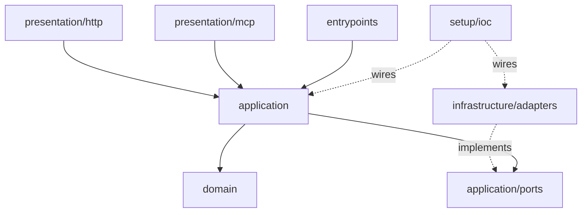

# appcore

A production-shaped FastAPI backend template: clean architecture, ports and adapters,
and an opt-in slice system.

It runs with one command and no credentials. Every optional dependency — Redis,
Prometheus, tracing, a message queue, an identity provider — ships a **null adapter**,
so the core is a working API on its own and scaling up is a swap in one provider
method rather than a rewrite.

```bash
docker compose up
```

Then:

```bash
curl -s localhost:8000/ready
```

---

## Why another template

Most FastAPI templates show you how to wire a framework. This one encodes the
things that only show up after a service has been in production for a while:

| Concern | What the template does |
| --- | --- |
| Readiness | `/ready` actually checks its dependencies and returns 503 when they are down |
| Money | `Decimal` everywhere, arithmetic across currencies raises |
| Concurrency | distributed lock **and** optimistic version — each covers what the other cannot |
| Retries | `Idempotency-Key` is a first-class port, not a per-endpoint hack |
| Timezones | one `TypeDecorator` at the column boundary, so naive datetimes cannot enter |
| Errors | RFC 9457 Problem Details from a single handler, status code declared on the error class |
| Metrics | route templates as labels, never raw paths — the standard way to melt Prometheus |
| Secrets | redaction lives in the log pipeline, not at call sites |
| Architecture | layering is enforced by `import-linter` in CI, not by a README promise |

## Architecture



Dependencies point one way: `presentation → application → domain`. Infrastructure
depends on the ports it implements and nothing depends on infrastructure except the
composition root. The domain imports nothing but the standard library.

A request walks the layers like this:

1. **Router** parses the request and calls one interactor. No business rules.
2. **Interactor** owns policy — rate limit, transaction boundary, metrics — and delegates.
3. **Domain** enforces invariants. A wallet cannot go negative because `Wallet.withdraw` says so, not because an endpoint remembered to check.
4. **Adapters** translate rows to entities and back.

## The example domain

A wallet ledger: open a wallet, deposit, withdraw, list entries. It is deliberately
not a to-do list — money forces the template to demonstrate invariants, concurrency,
idempotency and auditability instead of describing them.

```
POST   /v1/wallets                        open a wallet
GET    /v1/wallets                        list (cursor-paginated)
GET    /v1/wallets/{id}                   read one
POST   /v1/wallets/{id}/deposits          credit    (accepts Idempotency-Key)
POST   /v1/wallets/{id}/withdrawals       debit     (accepts Idempotency-Key)
GET    /v1/wallets/{id}/entries           ledger history
GET    /health  /ready  /version          operations
```

## Development

```bash
make sync      # install
make check     # format, lint, architecture contracts, types, tests
make run       # start the API
```

## Status

Milestone 1 (core + example slice) is in place. CI, the observability slice,
tracing, outbox, worker and MCP transport are landing next — see `docs/adr/` for the
decisions behind each.

## License

MIT
